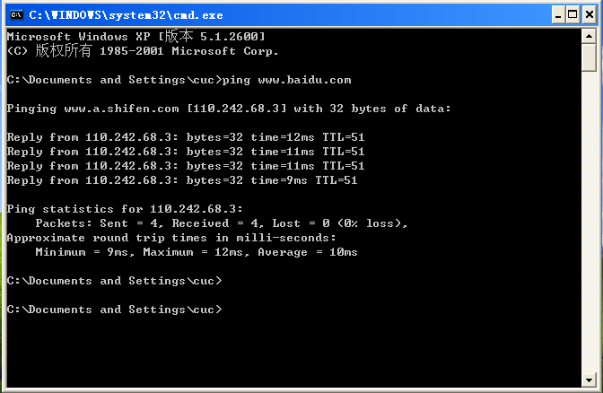

# 基于 VirtualBox 的网络攻防基础环境搭建

## 实验目的

* 掌握 VirtualBox 虚拟机的安装与使用；
* 掌握 VirtualBox 的虚拟网络类型和按需配置；
* 掌握 VirtualBox 的虚拟硬盘多重加载；

## 实验环境

以下是本次实验需要使用的网络节点说明和主要软件举例：

* VirtualBox 虚拟机
* 攻击者主机（Attacker）：Kali Rolling 2109.2
* 网关（Gateway, GW）：Debian Buster
* 靶机（Victim）：From Sqli to shell / xp-sp3 / Kali

## 实验要求

* 虚拟硬盘配置成多重加载，效果如下图所示；


* 搭建满足如下拓扑图所示的虚拟机网络拓扑；


> 根据实验宿主机的性能条件，可以适度精简靶机数量

* 完成以下网络连通性测试；
    - [x] 靶机可以直接访问攻击者主机
    - [x] 攻击者主机无法直接访问靶机
    - [x] 网关可以直接访问攻击者主机和靶机
    - [x] 靶机的所有对外上下行流量必须经过网关
    - [x] 所有节点均可以访问互联网

## 实验过程

**一、实验环境准备：**

* 设置多重加载：

  1.首先创建需多重加载的原始机（若已有相应的虚拟机则跳过）

  2.在虚拟介质管理器中将目标系统的vdi文件类型调整为多重加载。

  

* 搭建网络

  

  1.网关网卡配置：

  

  NAT网络：使网关可访问攻击者主机

  仅主机（Host-Only）网络：方便在主机环境中设置调整网关（可不设置）

  内部网络intnet1：搭建局域网1

  内部网络intnet2：搭建局域网2
  
  2.攻击机网卡配置：
  
  
  
  NAT网络
  
  3.靶机网卡配置：
  
  靶机均设置内部网络，根据归属内网的不同配置不同的内网网卡
  
  


**二、联通性测试**：

|  虚拟机名称   |     IP地址     |
| :-----------: | :------------: |
| attacker-kali |    10.0.2.4    |
|   vic-01-xp   | 172.16.111.105 |
|  vic-01-kali  | 172.16.111.115 |
|   vic-02-xp   | 172.16.222.137 |
| vic-02-debian | 172.16.222.123 |


* 靶机直接访问攻击者主机：

  内网01联通攻击者主机：

  

  内网02联通攻击者主机：

  

* 攻击者无法直接访问靶机：

  攻击者分别ping两个内网中的主机，均未ping通

  


* 网关直接访问攻击者主机和靶机：

  1.网关访问攻击者主机：

  

  2.网关访问靶机：

  内网01 ping通

  
  
  内网02  ping通
  
  

* 靶机的所有对外上下行流量必须经过网关

  要监控靶机的上下行流量是否经过网关，需要在网关处进行抓包并使用靶机链接外网，最后分析网关抓包数据是否与靶机链接外网行为相匹配。

  1.清空目标靶机的ARP缓存和DNS缓存

  

  2.使用tcpdump抓取：

  ```
  # 安装tcpdump：
  sudo apt update && apt install tcpdump
  ```

  先在网关处通过 `ip a` 命令获取目标网卡名称并开始抓取：

  

  ```
  # 抓包：
  sudo tcpdump -i [希望抓取的网卡名称] -n -w [数据保存为的文件名称]
  ```

  再于靶机上ping外部网站：

  

  通过保存为pcap文件，使得可以在主机当中用 wireshark 分析
  
  3.分析数据：
  
  

  观察wireshark中发送和返回的包的ip数据，可见其数量和收发方均符合靶机以及目标网址信息，可知靶机的所有对外上下行流量必须经过网关
  
* 所有节点均可访问互联网：

  vic-01-xp联通外网

  

  vic-01-kali联通外网

  
  
  vic-02-debian联通外网
  
  
  
  vic-02-xp联通外网
  
  
  
  攻击者联通外网
  
  
  
  

## 实验问题：

1.xp靶机可以单向联通网关，而网关尝试联通时无法成功：

ping 是通过发送 ICMP echo request 实现网络连通性检测，而windows防火墙会拦截过滤外部的request，因此需要关闭win xp的防火墙。

## 参考文献：

[NAT与NAT网络的区别](https://www.virtualbox.org/manual/ch06.html)

[tcp命令](https://blog.csdn.net/usstmiracle/article/details/120283282)
