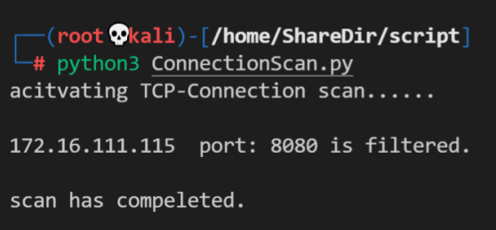
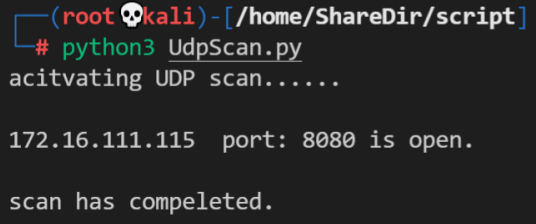

# 基于 Scapy 编写端口扫描器

## 实验目的 

* 掌握网络扫描之端口状态探测的基本原理

## 实验环境

* python + scapy

  [了解scapy](https://scapy.net/)

## 实验要求

* 自己搭建[局域网环境](### 网络拓扑信息：)，禁止探测互联网上的 IP ，严格遵守网络安全相关法律法规。

* 完成以下扫描技术的编程实现

    * [TCP connect scan](### TCP-Connection-Scan) / [TCP stealth scan](### TCP-stealth-Scan)
    * [TCP Xmas scan](### TCP-Xmax-Scan) / [TCP fin scan](### TCP-FIN-Scan) / [TCP null scan](### TCP-NULL-Scan)
    * [UDP scan](### UDP-Scan)
    
* 上述每种扫描技术的实现测试均需要测试端口状态为：`开放`、`关闭` 和 `过滤` 状态时的程序执行结果

* 提供每一次扫描测试的抓包结果并分析与课本中的扫描方法原理是否相符？如果不同，试分析原因；

* 在实验报告中详细说明实验网络环境拓扑、被测试 IP 的端口状态是如何模拟的

* （可选）复刻 `nmap` 的上述扫描技术实现的命令行参数开关


## 实验过程

### 网络拓扑信息：


* **端口状态模拟：**

**防火墙控制：** ufw工具

```
开启对端口的过滤：
sudo ufw enable && sudo ufw deny [端口号]/[过滤的包类型]
关闭对端口的过滤：
sudo ufw disable
查看端口防火墙状态：
sudo ufw status
```

**TCP端口模拟：**

```
python -m http.server [端口号]
```

端口开放：


端口过滤：


**UDP端口模拟：** 

```
ls|nc -l -u -p [端口号]
```

端口开放：


端口过滤：


  

  注：在打开一个模拟的端口前要查询使用端口使用情况：[Linux如何查看端口占用情况](https://www.runoob.com/w3cnote/linux-check-port-usage.html#:~:text=Linux%20%E6%9F%A5%E7%9C%8B%E7%AB%AF%E5%8F%A3%E5%8D%A0%E7%94%A8%E6%83%85%E5%86%B5%E5%8F%AF%E4%BB%A5%E4%BD%BF%E7%94%A8%20lsof%20%E5%92%8C%20netstat%20%E5%91%BD%E4%BB%A4%E3%80%82%20lsof%20lsof%28list,%E7%9A%84%E7%AB%AF%E5%8F%A3%E5%92%8C%E8%BF%9B%E7%A8%8B%E7%AD%89%E7%9B%B8%E5%85%B3%E6%83%85%E5%86%B5%E3%80%82%20netstat%20%E6%9F%A5%E7%9C%8B%E7%AB%AF%E5%8F%A3%E5%8D%A0%E7%94%A8%E8%AF%AD%E6%B3%95%E6%A0%BC%E5%BC%8F%EF%BC%9A%20netstat%20-tunlp%20%7C%20grep%20%E7%AB%AF%E5%8F%A3%E5%8F%B7)


### TCP-Connection-Scan

**代码：** [Connection-Scan](/code/ConnectionScan.py)

```
def TCP_Connection(ip,port):
    
    pkt=IP(dst=ip)/TCP(dport=int(port))

    ans=sr1(pkt,timeout=1,verbose=0)

    if ans is None:
        print(ip,' port:',port,'is filtered.')
    elif (ans.haslayer(TCP)):
        if ans[1].flags=='SA':
            print(ip,' port:',port,'is open.')
        elif ans[1].flags=='RA':
            print(ip,' port:',port,'is closed.')
```

**各状态结果：**

* 关闭：

  

* 开启：

  

* 过滤：

  
  

​	


### TCP-stealth-Scan

**代码：**  [SYNScan](code\SYNScan.py) 


```
def Synscan(ip,port):
    dstip=IP(dst=ip)/TCP(dport=int(port),flags="S")
    ans=sr1(dstip,timeout=1,verbose=0)
  
    if ans is None:
        print(ip,' port:',port,'is filtered.')
    elif ans.haslayer(TCP):
        if ans[1].flags=='SA':
            resend_ans=sr1(IP(dst=ip)/TCP(dport=port,flags="R"),timeout=1,verbose=0)
            print(ip,' port:',port,'is open.')
        else:
            print(ip,' port:',port,'is closed.')

```

**各状态结果：**

* 关闭：


* 开启：


* 过滤：

  


### TCP-Xmax-Scan

**代码：**  [XmasScan.py](code\XmasScan.py) 


```
def XmasScan(dstip,dstport):
    pkt=IP(dst=dstip)/TCP(dport=dstport,flags="FPU")
    ans = sr1(pkt,timeout=1,verbose=0)
    if ans is None:
        print(dstip,' port:',dstport,'is open or filtered.')
    elif(ans.haslayer(TCP)):
        if(ans[1].flags == "RA"):
            print(dstip,' port:',dstport,'is closed')
```

**各状态结果：**

* 关闭：


* 开启/过滤：


### TCP-FIN-Scan

**代码：**  [FinScan.py](code\FinScan.py) 


```
def FinScan(dstip,dstport):
    pkt=IP(dst=dstip)/TCP(dport=dstport,flags="F")
    ans = sr1(pkt,timeout=1,verbose=0)
    if ans is None:
        print(dstip,' port:',dstport,'is open or filtered.')
    elif(ans.haslayer(TCP)):
        if(ans[1].flags == 'RA'):
            print(dstip,' port:',dstport,'is closed')
```

**各状态结果：**

* 关闭：


* 开启/过滤：


### TCP-NULL-Scan

**代码：**  [NullScan.py](code\NullScan.py) 


```
def NullScan(dstip,dstport):
    pkt=IP(dst=dstip)/TCP(dport=dstport,flags="")
    ans = sr1(pkt,timeout=1,verbose=0)
    if ans is None:
        print(dstip,' port:',dstport,'is open or filtered.')
    elif(ans.haslayer(TCP)):
        if(ans[1].flags == 'RA'):
            print(dstip,' port:',dstport,'is closed')
```

**各状态结果：**

* 关闭：


* 开启/过滤：


### UDP-Scan

**代码：**  [UdpScan.py](code\UdpScan.py) 


```
def UdpScan(dstip,dstport,srsport):
    pkt = IP(dst=dstip)/UDP(dport=int(dstport),sport=srsport)
    ans = sr1(pkt,timeout=1,verbose=0)
    
    if ans is None:
        print(dstip,' port:',dstport,'is open or filtered.')
    elif ans.haslayer(UDP):
        print(dstip,' port:',dstport,'is open.')
    elif ans.haslayer(ICMP):
        if int(ans.getlayer(ICMP).type)==3 and int(ans.getlayer(ICMP).code)==3:
            print(dstip,' port:',dstport,'is closed')
```

**各状态结果：**

* 关闭：


* 开启：



该情况出现于靶机udp端口设置了回应信息的时候。

* 开启/过滤：


udp由于不建立链接的特性，如果在靶机的udp端口没有设置返回信息的情况下，即便是靶机端口处于打开的状态，攻击主机仍旧无法收到回应。


## TODO:

nmap复刻


## 参考资料:

[第五章课件](https://c4pr1c3.github.io/cuc-ns-ppt/chap0x05.md.html#/title-slide)

